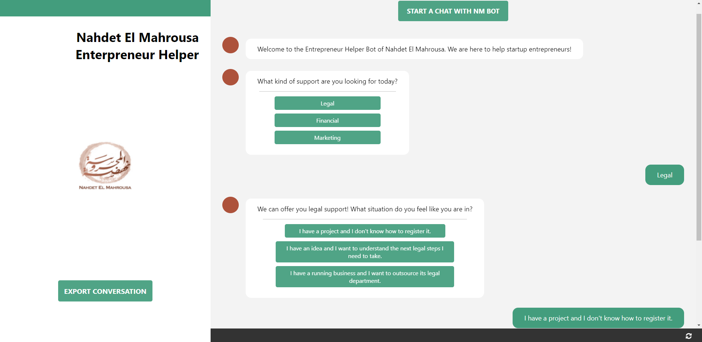
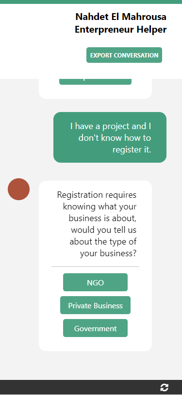
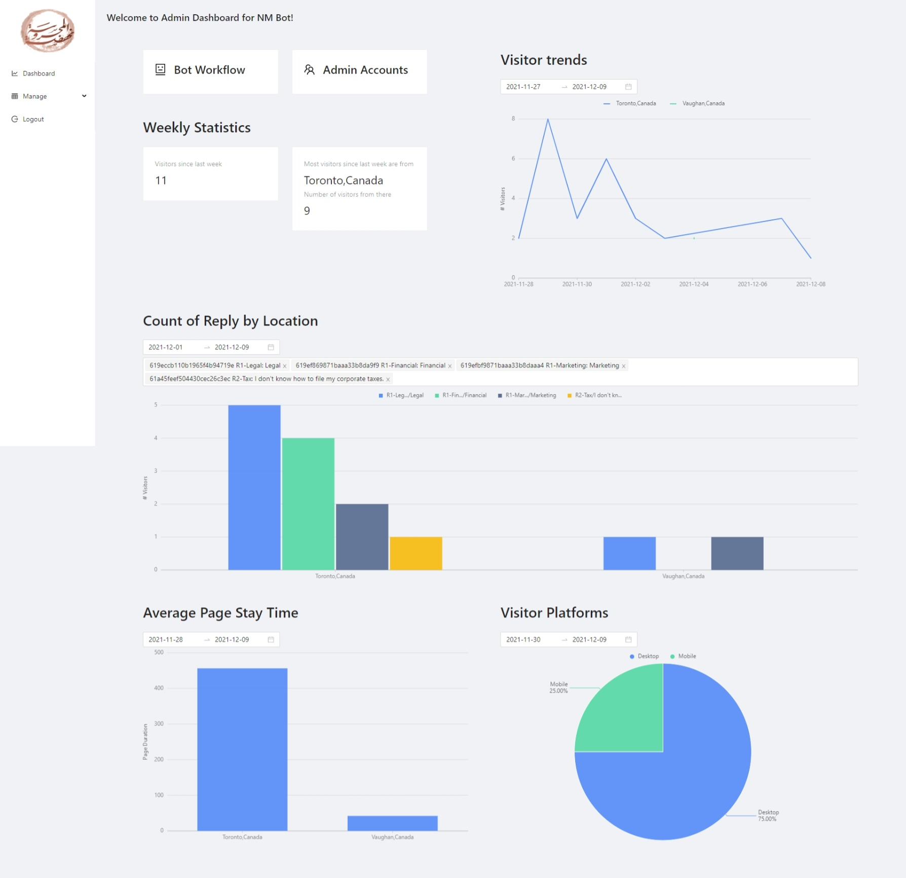
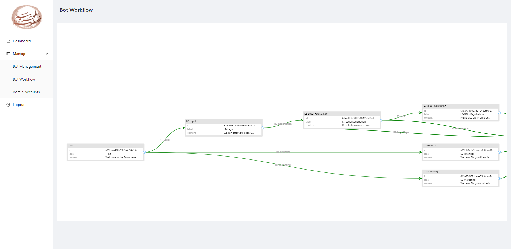
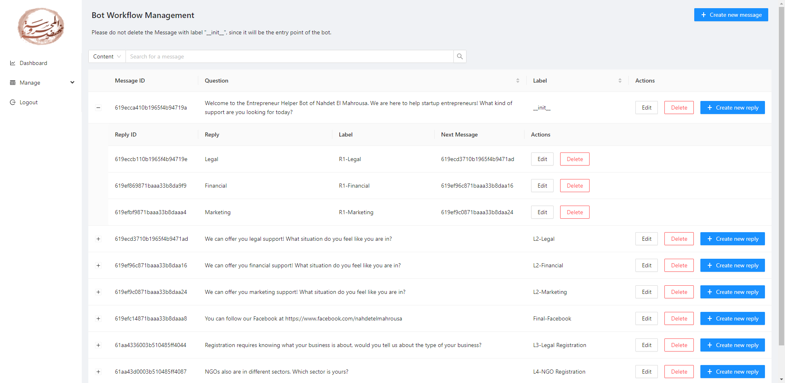
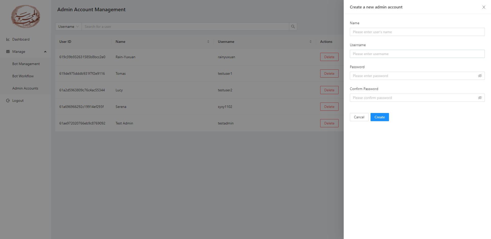

# NAHDET EL MAHROUSA - TEAM 11

A [MVP](https://en.wikipedia.org/wiki/Minimum_viable_product) web app project that provides inquiry support to Egyptian startup social entrepreneurs, whether the ideas are still in the proposals or they are facing hard decisions while running their startups.

## Background

[Nahdet El Mahrousa](https://www.nahdetelmahrousa.org/) (NM) is an Egyptian civil society organization with a mission to generate a positive and lasting impact on Egypt’s cultural, social, economic and environmental development by sustainably activating and engaging Egyptian youth and social entrepreneurs. The organization is looking for providing more accessible services to more clients, especially to those who live far away from them, and to common inquiry services in a more efficient workflow. Beyond this, the organization is looking for statistical data on social entrepreneurs' frequent concerns and where to access more clients.

## Project Introduction

NM Bot is a web app that provide inquiry services in an automated fashion. End-users can "chat" with the bot by choosing answer options that describe their situation. With a series of designed questions, the bot, with a designed workflow provided by Nahdet El Mahrousa, will locate their current concern and receive advice and guidance from the organization. In the admin dashboard, NM admins can manage the bot workflow and get statistics about the behaviors of the clients, including city, their responses, and stay time.

## [Demo](http://nm-bot-prod.herokuapp.com/)

## Features and Screenshots

### Bot-App

[](docs/images/app-desktop.png)

- Receive messages and select options that best describe user's situation.
- Export conversation to .txt file.
- Save chat history in localStorage, and reload when re-enter the app.
- Clear chat history.
- Responsive design

[](docs/images/app-mobile.png)

### Admin-Dashboard

#### Statistics

[](docs/images/admin-stat.jpeg)

#### Bot Management

[](docs/images/admin-bot-workflow.png)

[](docs/images/admin-bot-mng.png)

#### Admin Account Management

[](docs/images/admin-user.png)

## Setup Instructions

### Dependency Requirements

- [Node.js (preferably with version 14.16.1)](https://nodejs.org/en/)
- [MongoDB](https://www.mongodb.com/)

The project consists of three components: client-app (frontend), client-admin (frontend), and server (backend). The three components are independent of each other in terms of developing and building (except both frontend components need to communicate with the server through APIs). All three components are React/Node apps, each with its own package configuration and should run independently.

```sh
# In each of /server and /client-app and /client-admin

# Install dependencies
npm install

# Run the app
npm start
```

The frontend apps are communicating with the server through RESTful APIs, which are documented in the GitHub Wiki. The architecture of the server is multi-layer: API layer receives requests, lets the controller layer process the user input and catch errors; the service layer manipulates DAOs and Google API to manage data; the DAO layer provides basic interfaces to communicate with the Database.

Detailed instruction for each component is documented in the sub-directory of each component. Notice that you need to setup the `.env` files in each sub-directory.

## Tech Stack

### server

- Node.js (Express.js)
- googleapis
- JSON-web-token Authentication
- [Mongoose for MongoDB](https://mongoosejs.com/)

### client-admin

- React
- [Ant Design](https://ant.design/)
- React Redux (should deprecate)

### client-app

- React

### CI/CD

- GitHub Actions
- Heroku

## Deployment

The app is developed in two environments: *Staging/Testing* for development and testing in a running mock environment, in `staging` branch; *Production* is the production version for users, in `main` branch. Environment variables are loaded from `.env` files.

Deployment is automated by GitHub Actions, which is triggered when pushing to `staging` and `main` branches.

During deployment, environment variables for server will be loaded from GitHub Secrets. Currently, a env secret is in the following format:

```sh
KEY_1=\"VALUE_1\"\nKEY_2=\"VALUE_2\"\n.....
```

This does have some constraints and need improvements. **It is recommended that the environment variables should be configured directly in Heroku.**

## Future Improvements

### Features

- Multimedia in Bot (display images or videos)
- Allow end-users to write comments after chatting
- More mature admin dashboard system, including admin privilege restrictions and more user features

### Infrastructure

- Improve logging system
- More integrated frontend and backend
- Error handling

## License

This project is licensed under the terms of the MIT license. Nahdet El Mahrousa hopes this app can attract attentions to the issue of startup social entrepreneurs and evoke inspirations of similar apps.

## Contributions

Great thanks to Nahdet El Mahrousa, especially our partner Moustafa Kharma, who continuously provided us with support and advice.

Great thanks to the CSC301 course team, who gave us consideration, support, and the knowledge to build this project.

The development team:

- Yuxuan Liu
  - Architecture
  - Server: Bot admin APIs
  - Admin-dashboard: Statistics graphs, Workflow graph, Admin Account management
  - CI/CD
- Tianyang Hu
  - User and Authentication
  - Server: Client Bot API, Backend Search API
- Siyang Liu
  - Google Analytics for frontend and backend
- Yicheng Yin
  - Internal & External Communication
  - Admin-dashboard: Frontend
- Xinyao Yu
  - Admin-dashboard: Authentication, Bot management
- Yawen Xiao
  - Bot-app frontend
